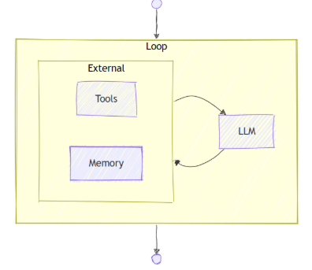
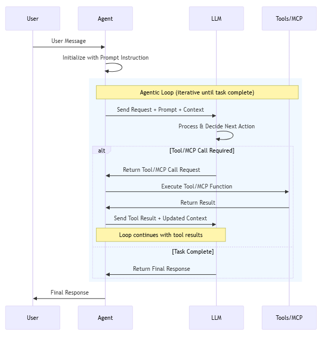
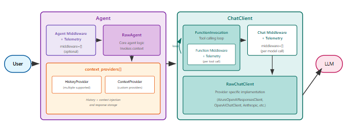
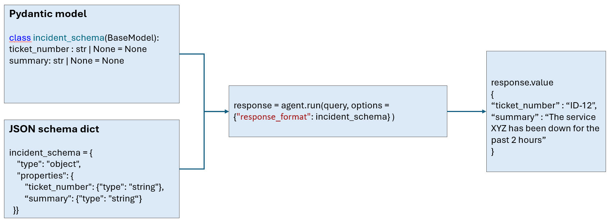
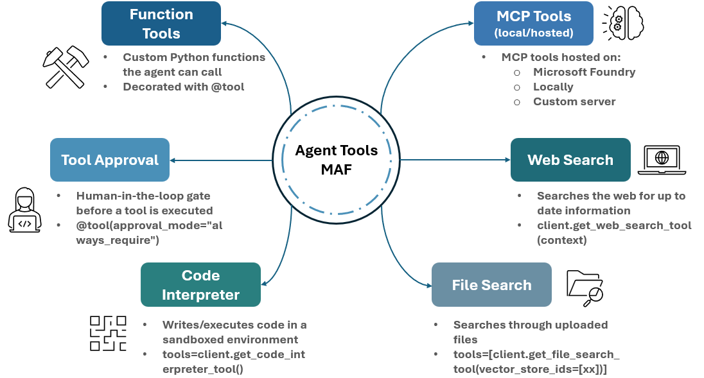

# Agents - Microsoft Agent Framework

## What is an Agent?
An agent is an autonomous unit driven by a large language model (LLM). It receives an input, decides which tools to call (if any), and produces a response. Steps are **dynamic** - the LLM determines the execution path based on context and available tools.

All agent types are derived from a common `Agent` base class, which provides a consistent interface for all agent types. This enables building agent-agnostic, higher-level functionality such as multi-agent orchestrations.

The framework supports the following agent categories:

| Type | Description |
|---|---|
| **Simple agents** | Built on top of any supported inference service (Azure AI Foundry, Azure OpenAI, OpenAI, Anthropic, Bedrock, Ollama, …). Created by passing a chat client to `Agent(client=...)`. Support function calling, multi-turn conversations, structured outputs, and streaming out of the box. For a comprehensive view on supported chat providers follow the [link](https://learn.microsoft.com/en-us/agent-framework/agents/?pivots=programming-language-python#simple-agents-based-on-inference-services-1)|
| **Custom agents** | Fully custom implementations (e.g. deterministic agents or API-backed agents). Implement `SupportsAgentRun` or extend `BaseAgent` directly. Useful when you need full control over the execution loop. For more information visit the [link](https://learn.microsoft.com/en-us/agent-framework/agents/providers/custom?pivots=programming-language-python) |
| **Other agent types** | Protocol-backed agents, such as the **A2A** proxy agent that connects to and invokes remote A2A-compliant agents. For more information visit the [link](https://learn.microsoft.com/en-us/agent-framework/integrations/a2a?tabs=dotnet-cli%2Cuser-secrets&pivots=programming-language-python) |

## Runtime Execution Model

Every agent runs a structured loop:

1. Receive user input (or a message from another executor/agent)
2. Send the input + conversation history to the LLM
3. If the LLM calls a tool → execute the tool, append the result, repeat from step 2
4. When the LLM produces a final text response → return it to the caller

This loop is deterministic and fully observable via events.

---

## Running Agents

> Full documentation: [Running Agents](https://learn.microsoft.com/en-us/agent-framework/agents/running-agents?pivots=programming-language-python)

Agents are invoked via `agent.run(input)`. The method supports two modes:

- **Non-streaming** - waits for the complete response and returns an `AgentResponse` object. Access the final text via `.text`, and all produced messages via `.messages`.
- **Streaming** - call `agent.run(input, stream=True)` to receive a `ResponseStream`. Iterate over it asynchronously to process `AgentResponseUpdate` chunks as they arrive, or call `.get_final_response()` to skip streaming and get the aggregated result directly.

Both types expose a `.text` shorthand that aggregates all `TextContent` items - use it to get the plain-text result without iterating over messages manually. For richer inspection (tool calls, reasoning, usage tokens, errors) drill into `.contents` on each message or update.

---

## Agent Pipeline Architecture

> Full documentation: [Agent pipeline architecture](https://learn.microsoft.com/en-us/agent-framework/agents/agent-pipeline?pivots=programming-language-python)

Every call to `agent.run()` passes through a layered pipeline. Understanding it helps you know where to inject cross-cutting behaviour.

**Agent layers (outer component)**

| Layer | Class | Purpose |
|---|---|---|
| Agent Middleware + Telemetry (Optional) | `AgentMiddlewareLayer` / `AgentTelemetryLayer` | Intercepts every `run()` call allowing you to inspect or modify inputs and outputs; handles emitting spans, events and metrics to a configured OpenTelemetry backend |
| RawAgent | - | Core logic: invokes context providers, collects per-run middleware |
| Context Providers | `context_providers` | Loads conversation history, injects additional context (e.g. RAG), adds per-run chat/function middleware via `SessionContext.extend_middleware()` |

**ChatClient layers (separate, swappable component)**

The chat client layer handles the actual communication with the LLM service.

| Layer | Purpose |
|---|---|
| FunctionInvocation | Manages the tool-calling loop; runs Function Middleware + Telemetry per tool call |
| Chat Middleware + Telemetry | Optional chain running once per model call |
| RawChatClient | Provider-specific LLM communication (Azure OpenAI, OpenAI, Anthropic, …) |

**Execution order**

1. Agent Middleware intercepts and records spans
2. Context providers load history and inject context
3. Request enters the ChatClient - FunctionInvocation drives the tool loop
4. RawChatClient calls the LLM; response bubbles back through all layers
5. Context providers receive `after_run` callbacks to persist new messages

Key extension points: add `middleware=[...]` on `Agent(...)` for cross-cutting agent logic; add `context_providers=[...]` for history management or RAG injection; swap the `client=` to change the LLM provider without touching anything else.

---

## Structured Outputs

> Full documentation: [Producing Structured Outputs with Agents](https://learn.microsoft.com/en-us/agent-framework/agents/structured-outputs?pivots=programming-language-python)

Agents can return type-safe, schema-validated responses instead of plain text. Pass `options={"response_format": <schema>}` to `agent.run()`, where the schema is either a **Pydantic model class** or a **JSON schema dict**.

- With a Pydantic model, the parsed instance is available in `response.value`.
- With a JSON schema dict, `response.value` contains the parsed `dict` or `list`.
- Works in both streaming and non-streaming modes - call `stream.get_final_response()` to get the parsed `.value` after iterating.

> Not all chat clients support structured outputs - check provider compatibility before use.

---

## Tools

> Full documentation: [Tools Overview](https://learn.microsoft.com/en-us/agent-framework/agents/tools/?pivots=programming-language-python)

Tools extend an agent's capabilities letting it call code, search files, browse the web, or invoke MCP servers. 

The LLM autonomously decides whether and which tool to call based on the tool's **name** and **description** primarely - these are surfaced to the model as a JSON schema at inference time, so clear, descriptive names and docstrings directly influence tool-selection quality. Tool use can be further influenced via the `tool_choice` option on `agent.run()`: omit it to let the model decide freely, set it to `"required"` to force at least one tool call, or name a specific tool to always invoke it via the `"required_function_name"`.

### Tool Types

Not every tool type is available on every provider - check the [provider support matrix](https://learn.microsoft.com/en-us/agent-framework/agents/tools/?pivots=programming-language-python#provider-support-matrix-1) in the docs. **Function Tools** and **Local MCP Tools** work with all providers that support function calling.

### Function Tools and tool approvals(`@tool`)

Decorate any Python function with `@tool` to make it callable by the agent. Use `approval_mode` to control whether the tool runs automatically or requires human approval first:

- `approval_mode="never_require"` - runs automatically (good for read-only, side-effect-free operations)
- `approval_mode="always_require"` - agent pauses and emits an approval-request event before running (use for any tool with side effects)

Pass tools to `Agent(tools=[...])` or `.as_agent(tools=[...])`.

### Agent as a Tool

An agent can itself be used as a tool for another agent via `.as_tool()`. The inner agent is invoked as a function call by the outer agent, enabling simple multi-agent composition without a full workflow.

---

## Conversations & Memory

> Full documentation: [Conversations & Memory overview](https://learn.microsoft.com/en-us/agent-framework/agents/conversations/?pivots=programming-language-python)

By default, each `agent.run()` call is stateless. To maintain conversation context across multiple turns, use `AgentSession`.

**Core pattern:**

1. Create a session with `agent.create_session()`
2. Pass it to every `agent.run(..., session=session)` call
3. The session accumulates message history and makes it available on the next turn

Sessions can be serialized (`session.to_dict()`) and restored (`AgentSession.from_dict(...)`) , or rehydrated from a service-side conversation ID via `agent.get_session(service_session_id="...")`.

| Topic | Key classes / options | Notes |
|---|---|---|
| **Session** | `AgentSession` (`session_id`, `service_session_id`, `state`) | • `AgentSession` is the conversation state container used across agent runs. It is passed to every `agent.run(..., session=session)` call   • For persistence across process restarts, serialize with `session.to_dict()` / and restore with `AgentSession.from_dict()`   • Restore an existing service conversation with `agent.get_session(service_session_id=...)` |
| **Context Providers/Storage** | `InMemoryHistoryProvider`, `ContextProvider`, `HistoryProvider`, `Agent(...,context_providers=[..]), require_per_service_call_history_persistence=True` | • `InMemoryHistoryProvider` is the built-in local conversational memory.   • `ContextProvider` for custom scenarios where you need to inject instructions, messages, or tools dynamically. Custom - `before_run` / `after_run` hooks. Can also add chat or function middleware for the current invocation by calling `context.extend_middleware(self.source_id, middleware)`.   • `HistoryProvider` for custom loading/storing messages. Custom `get_messages` / `save_messages`. Multiple providers can be configured, only one with `load_messages=True` (single source of truth). See [supported providers](https://learn.microsoft.com/en-us/agent-framework/integrations/?pivots=programming-language-python#chat-history-providers). If ´require_per_service_call_history_persistence´ set to True, conversations are persisted after each model call and not after a full run.
| **Context Compaction** | `TruncationStrategy`, `SlidingWindowStrategy`, `SummarizationStrategy`, `ToolResultCompactionStrategy`, `TokenBudgetComposedStrategy` | • Compaction strategies reduce the size of conversation history while preserving important context, so agents can continue functioning over long-running interactions.   • ⚠️ Compaction applies to **in-memory agents only**.   • To chose a strategy visit this [link](https://learn.microsoft.com/en-us/agent-framework/agents/conversations/compaction?pivots=programming-language-python#choosing-a-strategy). 

> Source: https://learn.microsoft.com/en-us/agent-framework/agents/conversations/

---

## References

- [Agents overview](https://learn.microsoft.com/en-us/agent-framework/agents/?pivots=programming-language-python)
- [Running agents](https://learn.microsoft.com/en-us/agent-framework/agents/running-agents?pivots=programming-language-python)
- [Agent pipeline architecture](https://learn.microsoft.com/en-us/agent-framework/agents/agent-pipeline?pivots=programming-language-python)
- [Structured outputs](https://learn.microsoft.com/en-us/agent-framework/agents/structured-outputs?pivots=programming-language-python)
- [Tools overview](https://learn.microsoft.com/en-us/agent-framework/agents/tools/?pivots=programming-language-python)
- [Tool approvals](https://learn.microsoft.com/en-us/agent-framework/agents/tools/tool-approvals?pivots=programming-language-python)
- [Conversations & Memory](https://learn.microsoft.com/en-us/agent-framework/agents/conversations/?pivots=programming-language-python)
- [Session](https://learn.microsoft.com/en-us/agent-framework/agents/conversations/session?pivots=programming-language-python)
- [Context providers](https://learn.microsoft.com/en-us/agent-framework/agents/conversations/context-providers?pivots=programming-language-python)
- [Storage](https://learn.microsoft.com/en-us/agent-framework/agents/conversations/storage?pivots=programming-language-python)
- [Context compaction](https://learn.microsoft.com/en-us/agent-framework/agents/conversations/compaction?pivots=programming-language-python)
- [Custom agents](https://learn.microsoft.com/en-us/agent-framework/agents/providers/custom?pivots=programming-language-python)
- [A2A integration](https://learn.microsoft.com/en-us/agent-framework/integrations/a2a?pivots=programming-language-python)
