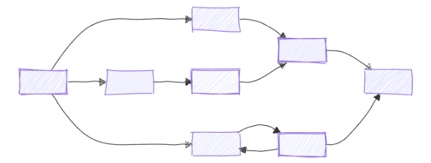

# Workflows - Microsoft Agent Framework

## What is a Workflow?

A workflow is a **predefined sequence of operations** that can include AI agents, custom logic, human-in-the-loop checkpoints, and external integrations. The execution path is explicitly defined by the developer - not determined at runtime by an LLM.



### Agent vs Workflow

| Agent | Workflow |
|---|---|
| LLM decides which steps to take | Developer defines every step |
| Dynamic, open-ended | Deterministic, structured |
| Single LLM call (possibly with tools) | Multiple executors coordinating in sequence or in parallel |
| Good for conversational Q&A | Good for business processes with well-defined stages |

## Core Concepts

### Executors

Executors are the **building blocks** of a workflow. Each executor is an autonomous processing unit that:
- Receives a typed input message
- Performs an operation (call an API, run an LLM, transform data, pause for human input…)
- Sends one or more messages to connected executors, or yields an output to the caller

Executors can be:

- Custom logic components (process data, call APIs, or transform messages) 
- AI agents (use LLMs to generate responses)

**Two implementation styles:**

- **Class-based** — extend the `Executor` base class and decorate handler methods with `@handler`. Each method handles one input type; the framework dispatches incoming messages to the correct handler based on the type annotation. Define multiple `@handler` methods on the same class to accept different message types.
- **Function-based** — decorate a standalone async function with `@executor(id="...")`. Useful for simple, single-handler executors with no shared state.

**Type annotations on handlers:** the handler's first parameter declares the input type; the second is `WorkflowContext[ForwardType, YieldType]` where `ForwardType` is the type sent via `send_message` and `YieldType` is the type emitted via `yield_output`. Omit the type parameters entirely if the handler only performs side effects (e.g. logging). For union or complex types, use explicit decorator parameters — `@handler(input=str, output=int, workflow_output=bool)` — but all types must then be declared via the decorator, not inferred from annotations.

### Edges

Edges connect executors and determine the flow of messages. The framework supports five edge patterns:

| Type | Purpose | When to use |
|---|---|---|
| **Direct** | Simple one-to-one connection | Linear pipelines |
| **Conditional** | Edge with a condition function that gates message flow | Binary routing (if/else) based on message content |
| **Switch-Case** | Route to different executors based on ordered case conditions; first matching case wins | Multi-branch routing; `WithDefault` ensures no message gets stuck |
| **Multi-Selection (Fan-out)** | One executor sends to multiple targets simultaneously via a target-selector function returning a list of indices | Parallel processing where the number of active branches depends on message content |
| **Fan-in (Barrier)** | Multiple executors converge into a single target; waits for all sources | Aggregation after parallel branches |

### WorkflowContext

The `WorkflowContext` object is injected into every handler and provides:

| Method | Purpose |
|---|---|
| `ctx.send_message(value)` | Forward a message to the next executor(s) |
| `ctx.yield_output(value)` | Produce a final output returned / streamed to the caller |
| `ctx.get_state(key)` | Read shared workflow state |
| `ctx.set_state(key, value)` | Write shared workflow state |
| `ctx.request_info(...)` | Pause and request human input (HITL) |

**Type parameters:**

```python
WorkflowContext[ForwardType, YieldType]
```

- `ForwardType` - type of messages sent via `send_message`
- `YieldType` - type of values emitted via `yield_output`

### WorkflowBuilder

Ties executors and edges together into a directed graph:

```python
from agent_framework import WorkflowBuilder

workflow = (
    WorkflowBuilder(
        name="MyWorkflow",
        start_executor=step_one,
        output_executors=[step_three],
    )
    .add_edge(step_one, step_two)
    .add_edge(step_two, step_three)
    .build()
)
```

---

## Multiple Input Types

An executor can handle different message types by defining multiple handlers:

```python
class SampleExecutor(Executor):

    @handler
    async def handle_text(self, text: str, ctx: WorkflowContext[str]) -> None:
        await ctx.send_message(text.upper())

    @handler
    async def handle_number(self, number: int, ctx: WorkflowContext[int]) -> None:
        await ctx.send_message(number * 2)
```

---

## Parallel Execution

Run multiple coroutines simultaneously inside an executor using `asyncio.gather()`:

```python
import asyncio

class ParallelExecutor(Executor):

    @handler
    async def run(self, request: MyInput, ctx: WorkflowContext[...]) -> None:
        result_a, result_b = await asyncio.gather(
            call_service_a(request),
            call_service_b(request),
        )
        # merge results and forward
        await ctx.send_message(merge(result_a, result_b))
```

---

## Human-in-the-Loop (HITL)

Pause a workflow and wait for human input using `ctx.request_info()` + `@response_handler`:

```python
from agent_framework import response_handler

class ApprovalGateway(Executor):

    @handler
    async def on_plan(self, plan: str, ctx: WorkflowContext[None, str]) -> None:
        await ctx.request_info(request_data="Please approve or reject.", response_type=str)

    @response_handler
    async def on_decision(self, original: str, decision: str, ctx: WorkflowContext[str]) -> None:
        if decision.strip().lower() == "approve":
            await ctx.send_message("approved")
        else:
            await ctx.yield_output(f"Rejected. Feedback: {decision}")
```

---

## Events

> Full documentation: [Events](https://learn.microsoft.com/en-us/agent-framework/workflows/events?pivots=programming-language-python)

The workflow event system provides real-time observability into execution. Events are emitted at key lifecycle points and consumed by iterating over the stream returned by `workflow.run(..., stream=True)`. Every event exposes a `type` discriminator string:

| Category | Event types | Notes |
|---|---|---|
| **Lifecycle** | `started`, `status`, `output`, `failed`, `error`, `warning` | `output` carries a final result; `failed` carries error details via `.details`; `started`, `status`, `failed` are **reserved** — executors cannot emit them |
| **Executor** | `executor_invoked`, `executor_completed`, `executor_failed`, `data` | `data` carries structured output (e.g. `AgentResponse`) emitted during a run |
| **Superstep** | `superstep_started`, `superstep_completed` | One pair per superstep cycle; useful for progress tracking |
| **HITL** | `request_info` | Pauses for human input; carries a `function_approval_request` payload when approval-required tools need sign-off |

**Custom events:** emit domain-specific signals from any handler via `ctx.add_event(WorkflowEvent(type="my_type", data=...))`. The `data` field accepts any value including structured dicts. Consume by filtering on the `type` string in the event loop. Useful for progress updates, diagnostics, and relaying domain data (e.g. database writes, metrics) to callers in real time.

---

## Execution Model

> Full documentation: [Workflow Builder & Execution](https://learn.microsoft.com/en-us/agent-framework/workflows/workflows?pivots=programming-language-python)

The framework uses a **Bulk Synchronous Parallel (BSP)** model inspired by Pregel, organizing execution into discrete **supersteps**.

Each superstep:
1. Collects all pending messages queued from the previous superstep
2. Routes them to target executors based on edge definitions and conditions
3. Runs all targeted executors **concurrently**
4. Applies a **synchronization barrier** — the workflow does not advance until every executor in the current superstep completes
5. Queues new messages and events emitted during the superstep for the next one

| Property | Detail |
|---|---|
| **Deterministic execution** | Same input always produces the same execution order |
| **Reliable checkpointing** | State snapshots at superstep boundaries enable fault-tolerant resume |
| **No race conditions** | Each superstep sees a consistent, complete view of all queued messages |
| **Fan-out implication** | If you fan out to a long chain and a single long-running executor, the chain cannot advance until the long-running executor finishes. To decouple them, consolidate the chain into one executor so both paths complete within the same superstep. |

**Workflow validation:** `WorkflowBuilder.build()` performs compile-time checks for type compatibility between connected executors, full graph reachability from the start executor, proper executor binding, and duplicate or invalid edges. Errors surface before execution starts.

---

## Key Features

| Feature | Description |
|---|---|
| **Type safety** | Strong typing on all message flows - framework validates compatibility at build time |
| **Flexible control flow** | Sequential, parallel, branching, and conditional routing |
| **Checkpointing** | Save and resume long-running workflows on the server side |
| **Human-in-the-loop** | Built-in `request_info` / `@response_handler` pattern |
| **Multi-agent orchestration** | Sequential, concurrent, handoff, and magentic patterns |
| **External integration** | Call APIs, databases, or MCP servers from any executor |

---

## Key Takeaways

- Workflows give you **explicit control** - every transition is defined in code.
- Executors are composable; the same executor can appear in multiple workflows.
- Use `ctx.set_state` / `ctx.get_state` to share data between executors without coupling them.
- HITL pauses are first-class - no custom polling or state machines needed.

---

## References

- [Workflows overview](https://learn.microsoft.com/en-us/agent-framework/workflows/)
- [Executors](https://learn.microsoft.com/en-us/agent-framework/workflows/executors)
- [Edges](https://learn.microsoft.com/en-us/agent-framework/workflows/edges)
- [Events](https://learn.microsoft.com/en-us/agent-framework/workflows/events)
- [Workflow Builder & Execution](https://learn.microsoft.com/en-us/agent-framework/workflows/workflows)
- [Python samples](https://github.com/microsoft/agent-framework/tree/main/python/samples/03-workflows)
